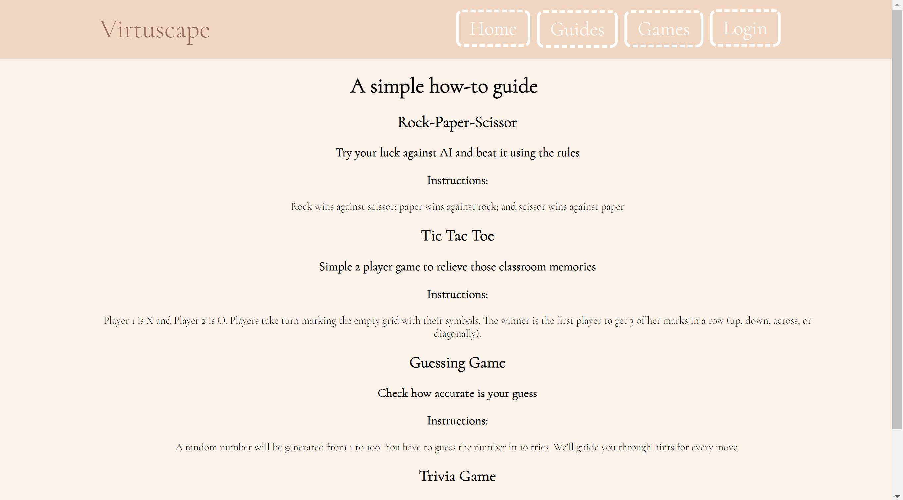

# Virtuscape
A place where modern users meet classic games. React app that consists of 3 to 4 games made with the help of some outside databases and API.

## Games

### Tick Tac Toe
Player 1 is X and Player 2 is O. Players take turn marking the empty grid with their symbols. The winner is the first player to get 3 of her marks in a row (up, down, across, or diagonally). 2 users are required to play this game or you can also play by yourself and be both Player 1 and 2.

### Guessing Numbers
A random number will be generated from 1 to 100. You have to guess the number in 10 tries. We'll guide you through hints for every move.

### Rock Paper Scissors
Play a game against an AI, where you will choose rock, paper, scissor first and the AI will go next. Rock wins against scissor; paper wins against rock; and scissor wins against paper

### Trivia Game (TBD)
There will be 10 questions. Every question will have 4 options with only one correct. Score will be based on correct answers.

## WebPage Outlook

### Index

### Guides

### Games

### Tick Tac Toe

### Guessing

### Trivia Game (TBD)

### Login

### Error

### Mobile NavBar

